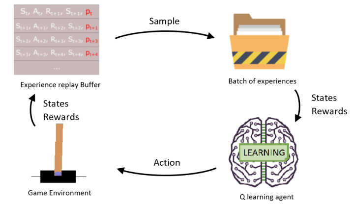
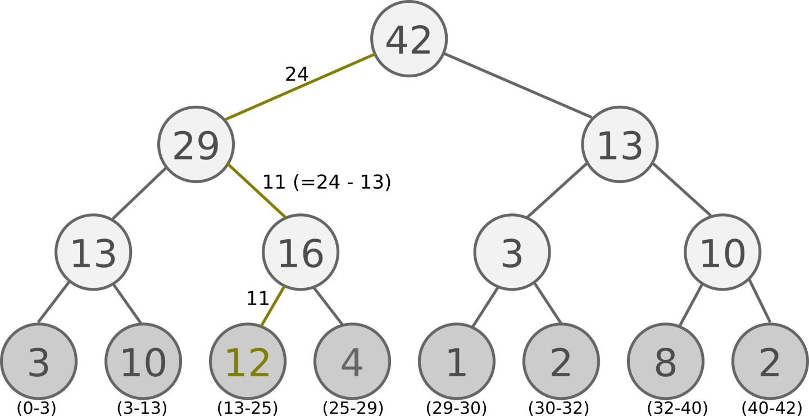
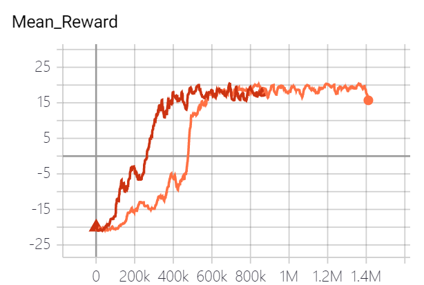

## Pytorch深度强化学习2. Prioritized Experience Replay

## 1. Priority
Prioritized experience replay是对原始DQN的一个很小，但非常重要的改进。这个改变非常简单，就是在原来的replay buffer中给每个experience增加了抽样的优先级（priority）。原始DQN每个experience是均匀抽样的。但是如果experience是有轻重之分，这样做会很没有效率，而加入优先级可以解决这一问题。

Prioritized experience replay的paper是一篇非常易读的文章，建议大家读下[原文](https://arxiv.org/pdf/1511.05952.pdf)。文章中，作者将experience对应的TD error的绝对值作为其优先级。TD error就是bootstrap的Q value减去原来估计的Q value：
$$Loss_{TD}=R_t+\gamma Q(s_{t+1},a_{t+1})−Q(s_t,a_t)$$
直觉上来说，TD error的绝对值与这一经验带给agent的surprise有很强的关系。也和deep learning中hard mining这一技巧相关，TD error越大，可能代表经验越难学，要多学几遍才行。并且在学习初期，reward不为0的经验往往会有更大的error，这样的抽样方法会使得Agent对reward附近的地方学的更好。

这个算法在实现上主要有两个要点，Sum Tree和优先级概率化。

## 2. Sum-tree 
Sum Tree是一个二元树结构，leaf的数量和memory size相同，leaf上存sample priority的数值，父节点的数值为子节点之和。如下图所示：

可以想象，最上面node的数值就是所有leaf node上数值之和。这个结构使得experience的插入和按priority抽样复杂度均为 O(log(n)) 。感觉树状结构的优势就是很多操作都可以达到 O(log(n)) 复杂度。用图中的sum tree结构举个抽样的例子：所有leaf node之和为42，从生成一个0到42的随机数，每个leaf node被抽到的概率与leaf node上数字大小成正比。假设抽到24，从最上层的node开始看，它的子节点分别对应左29，左边子节点29，24<29，选中左边子节点。现在在29这个子节点上，他的左子结点为13,24>13，减去13剩11，并进入它的右节点（16）。16对应的左子节点为12，11<12，进入左子节点，因为左子结点是leaf node，返回它，结束。一共8个node，抽样一次耗时log(8)=3步。在sum tree上抽样的伪代码如下给出，大家可以感受下：
```python
def retrieve(n, s):
  if n is leaf_node: return n

  if n.left.val >= s: return retrieve(n.left, s)
  else: return retrieve(n.right, s - n.left.val)
```
Sum-tree主要实现了几个函数：
- `add()`: 添加experience
- `get()`: 按priority抽样
- `update()`: 更新某个experience的priority。

代码如下:
```python
import numpy

# SumTree
# a binary tree data structure where the parent’s value is the sum of its children
class SumTree:
    write = 0

    def __init__(self, capacity):
        self.capacity = capacity
        self.tree = numpy.zeros(2 * capacity - 1)
        self.data = numpy.zeros(capacity, dtype=object)
        self.n_entries = 0

    # update to the root node
    def _propagate(self, idx, change):
        parent = (idx - 1) // 2

        self.tree[parent] += change

        if parent != 0:
            self._propagate(parent, change)

    # find sample on leaf node
    def _retrieve(self, idx, s):
        left = 2 * idx + 1
        right = left + 1

        if left >= len(self.tree):
            return idx

        if s <= self.tree[left]:
            return self._retrieve(left, s)
        else:
            return self._retrieve(right, s - self.tree[left])

    def total(self):
        return self.tree[0]

    # store priority and sample
    def add(self, p, data):
        idx = self.write + self.capacity - 1

        self.data[self.write] = data
        self.update(idx, p)

        self.write += 1
        if self.write >= self.capacity:
            self.write = 0

        if self.n_entries < self.capacity:
            self.n_entries += 1

    # update priority
    def update(self, idx, p):
        change = p - self.tree[idx]

        self.tree[idx] = p
        self._propagate(idx, change)

    # get priority and sample
    def get(self, s):
        idx = self._retrieve(0, s)
        dataIdx = idx - self.capacity + 1

        return (idx, self.tree[idx], self.data[dataIdx])
```

## 3. Priority to Probability
原文有两种方法计算experience抽样概率：proportional priority和rank-based priority。proportional priority就是experience被sample到的概率是正比于experience的priority；rank-based priority就是概率正比于experience priority的排序(rank)。这里只考虑proportional priority，假设第i个experience的priority为  ，那么他被抽样到的概率为：
$$P_i=p_i/\Sigma_j{p_j}$$
并且，为保证每一个存入的experience都能被sample到，新experience会被赋予一个很大的priority。

Memory buffer主要实现以下几个函数：
- `push()`: 插入新experience
- `sample()`: 按priority抽样experience
- `update()`: 更新已有经验的priority。代码如下：
```python
class Memory_Buffer_PER(object):
    # stored as ( s, a, r, s_ ) in SumTree
    def __init__(self, memory_size=1000, a = 0.6, e = 0.01):
        self.tree =  SumTree(memory_size)
        self.memory_size = memory_size
        self.prio_max = 0.1
        self.a = a
        self.e = e
        
    def push(self, state, action, reward, next_state, done):
        data = (state, action, reward, next_state, done)
        p = (np.abs(self.prio_max) + self.e) ** self.a #  proportional priority
        self.tree.add(p, data)

    def sample(self, batch_size):
        states, actions, rewards, next_states, dones = [], [], [], [], []
        idxs = []
        segment = self.tree.total() / batch_size
        priorities = []

        for i in range(batch_size):
            a = segment * i
            b = segment * (i + 1)
            s = random.uniform(a, b)
            idx, p, data = self.tree.get(s)
            
            state, action, reward, next_state, done= data
            states.append(state)
            actions.append(action)
            rewards.append(reward)
            next_states.append(next_state)
            dones.append(done)
            priorities.append(p)
            idxs.append(idx)
        return idxs, np.concatenate(states), actions, rewards, np.concatenate(next_states), dones
    
    def update(self, idxs, errors):
        self.prio_max = max(self.prio_max, max(np.abs(errors)))
        for i, idx in enumerate(idxs):
            p = (np.abs(errors[i]) + self.e) ** self.a
            self.tree.update(idx, p) 
        
    def size(self):
        return self.tree.n_entries
```
另外paper里提到，如果改变了experience抽样的概率，可能会使得训练的behavior policy和target policy不同。为了克服这一点，使用了importance sampling的方法来下调高priority的experience更新权重时的权值变化。因为在之后Rainbow的文章中，也没有再提到类似importance sampling修正的方法，我个人感觉importance sampling在这可能没什么用，没有实现这部分。有兴趣的可以自己了解下。

## 4. Results

我在atari game中的"Pong"里测试了原始DQN和DQN with piroritized experience replay的表现。​下面我们看一下训练结果：



图中是不同方法对应的平均收益（10个episode滑动平均），橘黄色线条代表原始DQN (uniform replay)，红色线条代表DQN with piroritized experience replay。可以看piroritized experience replay可以极大的提升学习效率，比原始DQN快了30~40%，只用了40多万帧就学会了这个游戏（GPU训练了约8个小时）。

## 5. Thoughts
在实现了DQN后，再实现piroritized experience replay并不是很复杂，差不多花了1天时间就完成了实现+测试。结果异常的好，不枉我这么喜欢这篇paper。至于这个方法为什么这么好，我觉得主要有以下三点：

第一，novel experience的priority被初始化的很高，保证了新的experience至少能被学一次。而原始DQN是uniform sampling，不管experieince新旧，可能导致有些novel experience可能一辈子都sample不到，而这些experience是通过更新的policy得来的，会对学习更有帮助。

第二，reward很sparse，而且得到reward地方很可能TD error很大（想象最初时候，每个state的Q值都接近0）。把这部分experience的priority设置很高，有助于减轻sparse reward的问题，加快学习。

第三，和hard mining技巧的思想一致，TD error大的地方就是难学的地方，多学几遍会加强performance。

代码放在 https://github.com/AmazingAng/deep-RL-elements ，有需要的可以去看。