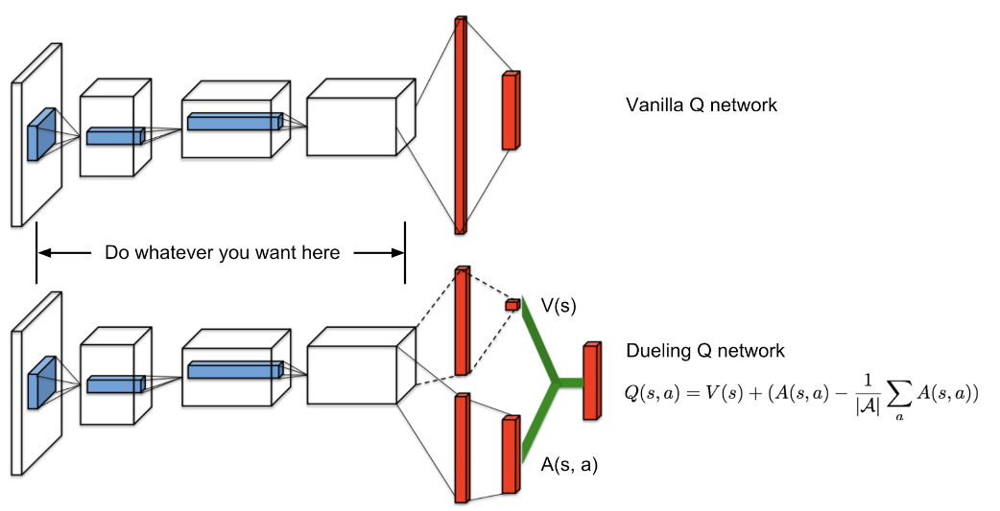

# Pytorch深度强化学习4. Dueling DQN

## 1. Advantage Function and Dueling DQN
在估计Q(s, a)的时候，我们可以做一个分解：
$$Q(s, a) = V(s) + A(s,a)$$

其中V(s)为state value，和state相关，和action无关； A(s, a)为advantage function，衡量每个action相对于其它action有多好。在policy gradient中，这个方法可以减少学习时error的方差，使得学习更加稳定。

在DQN中，对每个state估计N个Q(s,a)太多了，可能会不稳定；而对每个state估计1个V(s)，外加几个接近0的 A(s, a)会更简单。因此，就产生了Dueling DQN，同时估计A(s, a)和V(s)。
​


Dueling DQN在DQN上的修改也很小，只是多出一支fully connected layer来估计V(s)。代码如下：
```python
class Dueling_DQN(nn.Module):
    def __init__(self, input_shape, num_outputs):
        super(Dueling_DQN, self).__init__()
        
        self.input_shape = input_shape
        self.num_actions = num_outputs
        
        self.features = nn.Sequential(
            nn.Conv2d(input_shape[0], 32, kernel_size=8, stride=4),
            nn.ReLU(),
            nn.Conv2d(32, 64, kernel_size=4, stride=2),
            nn.ReLU(),
            nn.Conv2d(64, 64, kernel_size=3, stride=1),
            nn.ReLU()
        )
        
        self.advantage = nn.Sequential(
            nn.Linear(self.feature_size(), 512),
            nn.ReLU(),
            nn.Linear(512, num_outputs)
        )
        
        self.value = nn.Sequential(
            nn.Linear(self.feature_size(), 512),
            nn.ReLU(),
            nn.Linear(512, 1)
        )
        
    def forward(self, x):
        x = self.features(x)
        x = x.view(x.size(0), -1)
        advantage = self.advantage(x)
        value     = self.value(x)
        return value + advantage  - advantage.mean()
    
    def feature_size(self):
        return self.features(autograd.Variable(torch.zeros(1, *self.input_shape))).view(1, -1).size(1)
```

## 2. Results
我们来看下训练结果，下图是DDQN（蓝色），Dueling DQN（粉红）和DQN（橘黄）在Pong上面得表现。可以看到DDQN > Dueling DQN > DQN，其中DDQN大约比DQN得收敛快10%。


## 3. Thoughts
Dueling DQN的实现很容易，在Pong这个游戏上的提升也不大。可能效果要在更难的任务中才能看出来。

代码在 https://github.com/AmazingAng/deep-RL-elements