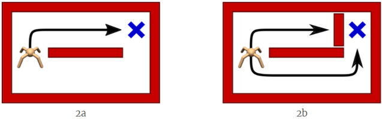
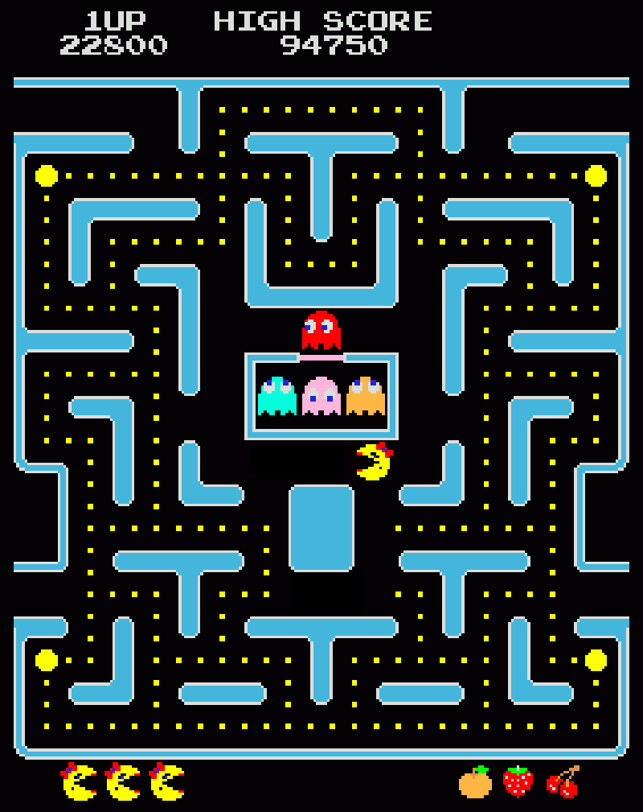
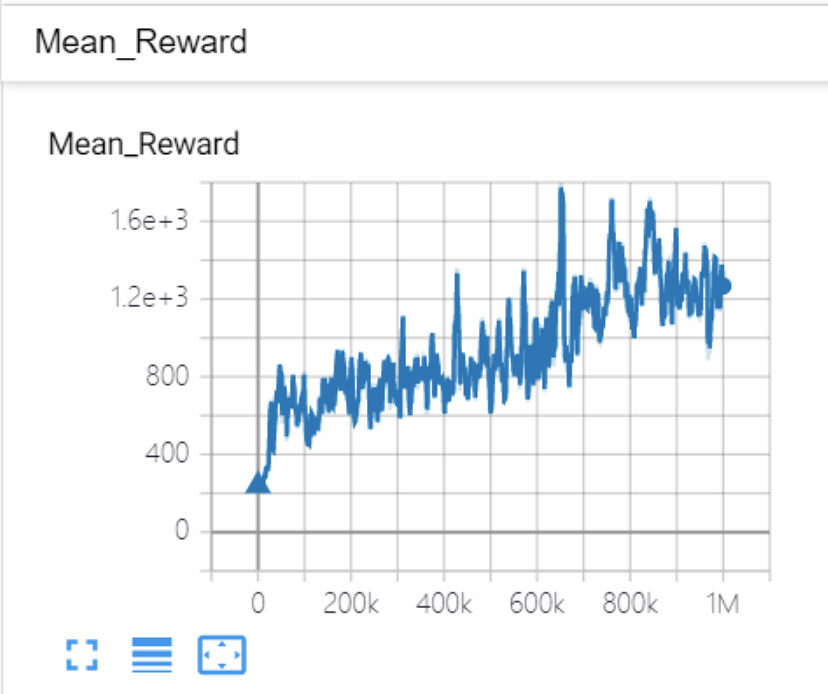

## Pytorch深度强化学习5. Soft Q Learning

## 1. Maximum Entropy Reinforcement Learning
​



在传统RL中，agent的目标是最大cumulative discounted rewards:
$$G_t  = R_t + \gamma R_{t+1} + \gamma ^2 R_{t+2} + ... = \sum_{i = 0}^{\infty}\gamma ^i R_{t+i} $$
而这样设立目标的一个问题就是agent只能学习到单一的策略，exploration和generalization很差。而maximum entropy （max-ent） RL则通过修改rewards，来减轻这一问题。在max-ent RL中，rewards是entropy-augmented rewards，在常规rewards上加了一个entropy regularization term，鼓励agent运用多样化的策略。entropy-augmented rewards如下：
$$r(s, a) = R(s, a) + \alpha H(\pi(\cdot|s))  $$
其中H()函数是求熵。那么，agent目标就变成了两个：最大化收益，同时还要最大化策略的多样性。系数 α 用来权衡两个目标的比重。
## 2. Soft Q Learning
Soft Q Learning是解决max-ent RL问题的一种算法，最早用在continuous action task（mujoco benchmark）中。它相比policy-based的算法（DDPG，PPO等），表现更好并且学习更加稳定。这里我主要介绍Soft Q Learning在discrete action task上面如何使用。相比continuous action task，discrete action task不需要使用policy network，十分简单易懂。

类似于Q learning，我们先要定义算法的value function。这里，我们定义soft Q function和soft Value function：
$$Q^\text{soft}_\pi (s, a) = r(s, a) + \gamma V^\text{soft}_\pi(s') $$
$$V^\text{soft}_\pi(s) =  E_{a}{\{Q^\text{soft}_{\pi}(s,a) - \log(\pi(a|s))\}} =\alpha\log\sum_a\exp(\frac{1}{\alpha}Q^\text{soft}_\pi (s, a))   $$
我们可以利用上面定义的soft Q function的Bellman Equation来进行policy evaluation。原paper中有证明这样的soft policy evaluation可以使得soft Q function收敛到true soft Q function。

而更新策略的方法也比较简单，是动作soft Q value的softmax值作为选择该动作的概率，如下：
$$\pi(a| s)  = \text{softmax}_a{(\frac{1}{\alpha}Q^\text{soft}_\pi (s, a))}$$
可以看到，Q learning中max操作，改为了softmax操作，使得对应非最优Q值的动作也能有概率被选择，从而提升算法的exploration和generalization。原paper中有证明这样的soft policy improvement可以使得soft Q function的数值增加。
我们只需要改变DQN的policy evaluation和policy improvement的代码，就可以实现soft-DQN。改动后计算TD-loss的代码如下如下：
```python
def compute_td_loss(self, states, actions, rewards, next_states, is_done, gamma=0.99):
    """ Compute td loss using torch operations only. Use the formula above. """
    actions = torch.tensor(actions).long()    # shape: [batch_size]
    rewards = torch.tensor(rewards, dtype =torch.float)  # shape: [batch_size]
    is_done = torch.tensor(is_done).bool()  # shape: [batch_size]

    if self.USE_CUDA:
        actions = actions.cuda()
        rewards = rewards.cuda()
        is_done = is_done.cuda()

    # get q-values for all actions in current states
    predicted_qvalues = self.DQN(states)

    # select q-values for chosen actions
    predicted_qvalues_for_actions = predicted_qvalues[
      range(states.shape[0]), actions
    ]

    # compute q-values for all actions in next states
    predicted_next_qvalues = self.DQN_target(next_states) # YOUR CODE
    # compute V*(next_states) using predicted next q-values
    next_state_values =  self.alpha*torch.logsumexp(predicted_next_qvalues/self.alpha, dim = -1) # YOUR CODE        

    # compute "target q-values" for loss - it's what's inside square parentheses in the above formula.
    target_qvalues_for_actions = rewards + gamma*next_state_values # YOUR CODE

    # at the last state we shall use simplified formula: Q(s,a) = r(s,a) since s' doesn't exist
    target_qvalues_for_actions = torch.where(
        is_done, rewards, target_qvalues_for_actions)

    # mean squared error loss to minimize
    #loss = torch.mean((predicted_qvalues_for_actions -
    #                   target_qvalues_for_actions.detach()) ** 2)
    loss = F.smooth_l1_loss(predicted_qvalues_for_actions, target_qvalues_for_actions.detach())

    return loss
```
## 3. Results
因为不明原因，soft-DQN在Pong游戏上的表现非常的差，这里利用它来完成MsPacman游戏。MsPacman估计大家小时候都玩过，就是吃糖豆。
​

DQN在这款游戏上的学习较慢（大概需要20M步），而Soft-DQN可以很快的在1M步内学习，结果如下（DQN的结果没有展示）：
​


代码在 https://github.com/AmazingAng/deep-RL-elements
