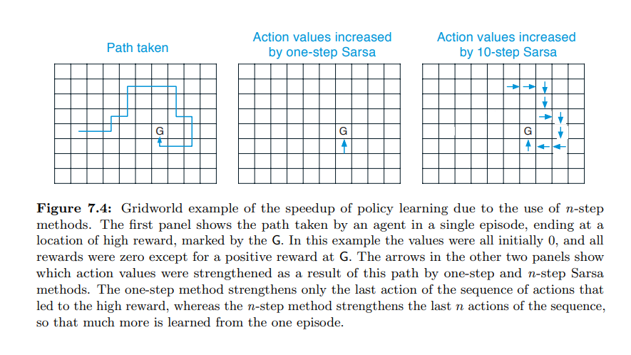
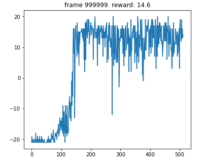

# Pytorch深度强化学习9. N-step DQN

## 1. N-step Bootstrap
在Sutton的书中，有专门的一章介绍N-step bootstrap。N-step bootstrap是介于Monte-Carlo和one-step TD之间的一种方法，很多时候可以达到更好的效果。它主要就是将TD中的one-step return改为由N个transition得到的N-step return。我们定义N-step target:

$$G_{t:t+n} = \sum_{k=0}^{n-1} \gamma^{k}R_{t+k+1}+ \gamma^n\text{max}_{A'}[Q(S_{t+n},A')]$$

那么我们可以利用这个target来更新value function:

$$Q_{new}(S_t,A_t)=Q_{old}(S_t,A_t) + \alpha(G_{t:t+n}-Q_{old}(S_t,A_t) )$$



上图是在Sutton书中举得一个例子[1]，来展示N-step bootstrap的优势：当reward很稀疏的时候，one-step TD只有当sample到的一个transition具有reward信息才能学习，而N-step bootstrap可以sample到N个transition，其中只要有具有reward信息的transition，就可以学习。因此，N-step bootstrap会有更好的学习效率。

## 2. N-step DQN
在深度强化学习中，n-step bootstrapping同样具有优势，比如在Rainbow算法中，发现加入N-step return可以有效增加performance [2]。常见的n-step方法有Retrace，n-step sarsa这种对off-policyness做修正的，也有直接用N-step return替换1-step return的方法，都被证明有效 [3]。本文中选择能与DQN结合的最简单的方法，即1-step return替换为N-step return（N-step target 的定义见上一节）。

## 3. Code
将标准的DQN改为N-step DQN其实很简单，主要工作主要是两点:

### 3.1 改变Replay Buffer
从sample单个transition，改为sample N个transition，计算N-step return，并处理好episode ending。这里给出N-step replay buffer的代码：
```python
class Nstep_Memory_Buffer(object):
    # memory buffer to store episodic memory
    def __init__(self, memory_size=1000, n_multi_step = 1, gamma = 0.99):
        self.buffer = []
        self.memory_size = memory_size
        self.n_multi_step = n_multi_step
        self.gamma = gamma
        self.next_idx = 0
        
    def push(self, state, action, reward, next_state, done):
        data = (state, action, reward, next_state, done)
        if len(self.buffer) <= self.memory_size: # buffer not full
            self.buffer.append(data)
        else: # buffer is full
            self.buffer[self.next_idx] = data
        self.next_idx = (self.next_idx + 1) % self.memory_size

    def sample(self, batch_size):
        # sample episodic memory
        states, actions, rewards, next_states, dones = [], [], [], [], []
        for i in range(batch_size):
            finish = random.randint(self.n_multi_step, self.size() - 1)
            begin = finish-self.n_multi_step
            sum_reward = 0 # n_step rewards
            data = self.buffer[begin:finish]
            state = data[0][0]
            action = data[0][1]
            for j in range(self.n_multi_step):
                # compute the n-th reward
                sum_reward += (self.gamma**j) * data[j][2]
                if data[j][4]:
                    # manage end of episode
                    states_look_ahead = data[j][3]
                    done_look_ahead = True
                    break
                else:
                    states_look_ahead = data[j][3]
                    done_look_ahead = False
            
            states.append(state)
            actions.append(action)
            rewards.append(sum_reward)
            next_states.append(states_look_ahead)
            dones.append(done_look_ahead)

        return np.concatenate(states), actions, rewards, np.concatenate(next_states), dones
    
    def size(self):
        return len(self.buffer)
```
### 3.2 改变target
我们需要将DQN的1-step target改为N-step target，代码如下：
```python
# compute "target q-values" for loss - it's what's inside square parentheses in the above formula.
target_qvalues_for_actions = rewards + (self.gamma**self.n_multi_step) *next_state_values
```

## 4. Results



第一次跑的结果并不是很理想，在Atari games的Pong环境中，蓝线是1-step DQN，红线是N-step DQN (N=8)。可以看到，1-step DQN学会了游戏，而N-step DQN没有。我打算将N从8调整到4再试下。

第二次跑的时候将N设为4，明显这次的学习稳定得多，在150个episodes时基本学会。可能是因为N小的时候，学习受off-policyness的影响越小？
​
## 5. References

[1] Sutton R S, Barto A G. Reinforcement learning: An introduction[M]. MIT press, 2018.

[2] Hessel M, Modayil J, Van Hasselt H, et al. Rainbow: Combining improvements in deep reinforcement learning[C]//Proceedings of the AAAI Conference on Artificial Intelligence. 2018, 32(1).

[3] Hernandez-Garcia J F, Sutton R S. Understanding multi-step deep reinforcement learning: A systematic study of the DQN target[J]. arXiv preprint arXiv:1901.07510, 2019.

代码开源在 https://github.com/AmazingAng/deep-RL-elements
